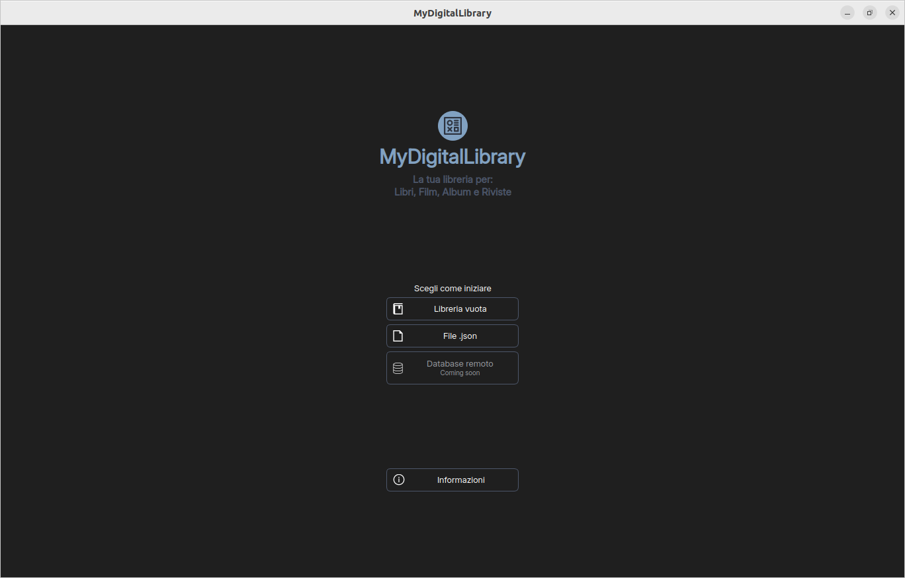
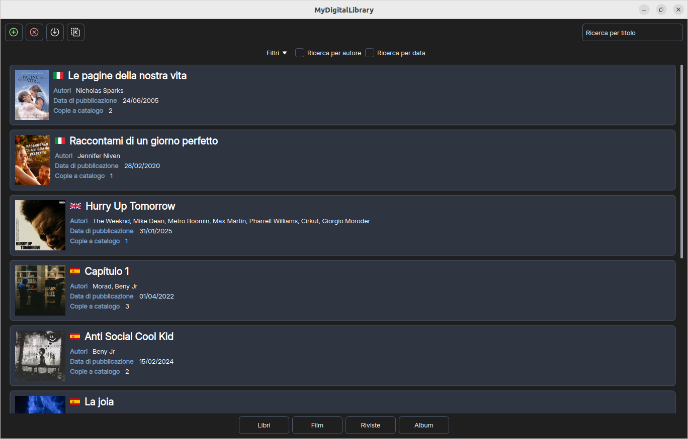
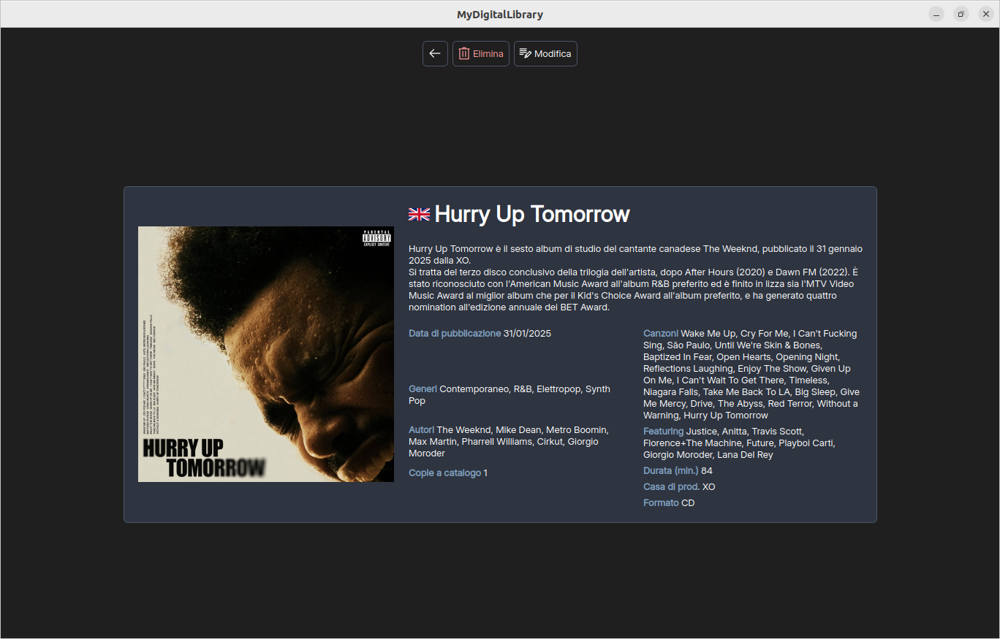
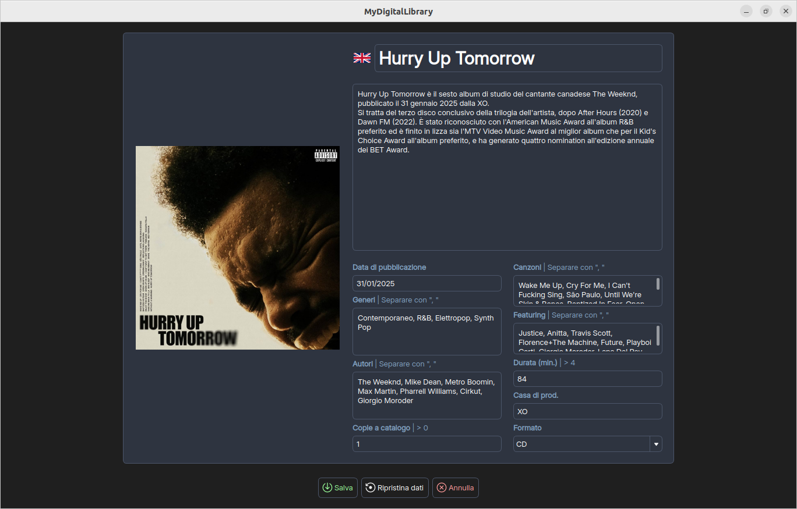

# MyDigitalLibrary (Libreria digitale)
## AA24/25 - Progetto del corso **Programmazione ad Oggetti** [SC02123180]
Il seguente progetto è un lavoro realizzato singolarmente per il conseguimento del 50% della valutazione del corso sopracitato.

**La valutazione per questo lavoro è stata: 30 con lode.**

La traccia accademica prevedeva la realizzazione di un'applicazione in linguaggio C++ e framework Qt per la gestione di Media (classe base astratta) all'interno di una libreria digitale.
Le classi derivate concrete dell'applicazione dovevano essere almeno 3, sui quali oggetti istanziati potevano essere svolte almeno le operazioni CRUD; richiesta esplicita della commessa era la creazione di funzionalità per la persistenza dei dati all'interno di file system (formato XML o JSON).
Fondamentale per la riuscita del progetto risultava l'implementazione di design pattern MVC.

## Contenuto del repository
Il lavoro è completo dei seguenti elementi:
* progetto completo di tutti i file di classe e risorse necessari;
* [relazione tecnica](Relazione/RelazioneTecnica.pdf) con i seguenti approfondimenti:
  * descrizione del modello MVC che organizza il funzionamento del prodotto software;
  * spiegazione dell'utilizzo "non banale" di polimorfismo, principalmente grazie all'implementazioe di design pattern Visitor;
  * descrizione delle implementazioni funzionali e grafiche;
  * rendicontazione delle ore impiegate per portare a termine il lavoro;
  * possibili sviluppi futuri.
* [diagramma UML](Relazione/DiagrammaUML.svg) completo di tutte le classi che compongono il prodotto;
* file [Salvataggio.json](EsempioPersistenza/Salvataggio.json) per un esempio di persistenza dei dati;

## Previews del prodotto software

  
  
  
  

  1. Finestra iniziale per l'avvio del prodotto software.
  2. Finestra per la visualizzazione del catalogo di Media.
  3. Finestra per la visualizzazione dei dettagli del Media selezionato.
  4. Form di editing per un Media nuovo/esistente.

